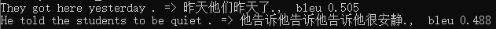

# 一个简单的机器翻译（英译中）模型

本项目机器翻译模型来源基于经典的自然语言处理Transformer模型，原论文为[Attention Is All You Need](https://arxiv.org/pdf/1706.03762.pdf)，论文所做的工作是奠基之作，其思想不仅是在机器翻译，还被应用到语音、图像等各个领域。下面是论文中给出的模型架构图：  

在数据来源上，本项目的中英互译数据集来自[http://www.manythings.org/anki/](http://www.manythings.org/anki/)，网站除了中英互译，还提供了许多其他数据集。对数据集的预处理上，我们将所有中文标点转为英文，从而避免标点对翻译的影响；之后我们将句子词元化，将英文分为一个个单词，将中文分成一个个字；最后经过对数据集中每个句子的长度的统计，我们选定了时间步即一个序列的最长长度为30，并进行填充和截断。  
本项目设计的模型为Transformer模型的蒸馏版，使用更小的超参数，更少的模型参数来减少训练时间，除此之外，模型的架构等都同Transformer完全相同，使用纯注意力机制，没有RNN和CNN相关的设计。  
因为硬件条件有限，模型训练了200个epoch，在我的笔记本上训练了7个多小时。在训练结束时，模型损失还呈下降趋势，模型还没有收敛。我们将训练好的模型给出，在model目录下。
我们使用了两个简单的英文句子进行测试，由于模型没有收敛，测试结果一般，下面给出测试结果：

环境：python3.8，tensorflow2.4.0  
作者：Zhiyi Xue(薛志一) 华东师范大学  
欢迎对该项目提出任何宝贵意见和建议。请留言或发邮件至xuezhiyi2000@163.com